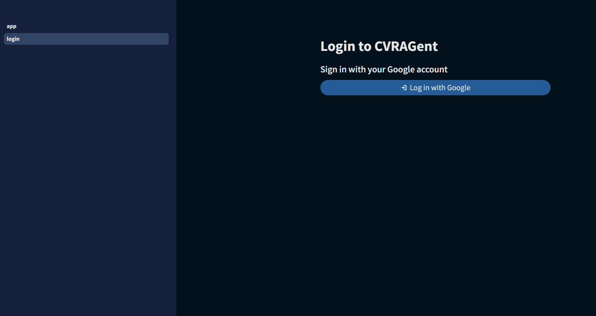
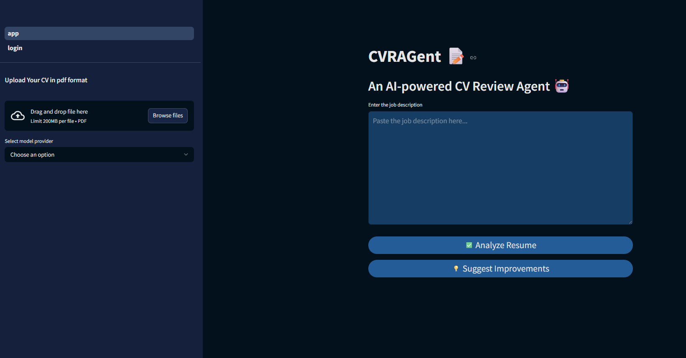

# CVRAGent 📝

An AI-powered CV Review Agent that utilizes Large Language Models (LLM) and Retrieval-Augmented Generation (RAG) to enhance your CV and provide intelligent feedback.

## 📸 Application UI

### Login Page


### Main Application UI


### Demo


## Features 🚀

CVRAGent can help you with the following:
1. **CV Analysis**: Determines the relevance of your CV to a specific job description
2. **Improvement Suggestions**: Suggests key sentences and improvements based on job requirements
3. **AI-Powered Insights**: Uses state-of-the-art language models for comprehensive CV evaluation

## Prerequisites 📋

- Python 3.10 or higher
- Streamlit (for the UI)
- LangChain (LLM integration)
- Authlib (Google auth)
- Poetry (Python dependency management tool)

## Installation & Setup 🛠️

### 1. Clone the Repository

```bash
git clone https://github.com/HamzaSulaiman1996/CVRAGent.git
cd CVRAGent
```

### 2. Install Poetry

If you don't have Poetry installed, install it using one of these methods:

**On Linux/macOS:**
```bash
curl -sSL https://install.python-poetry.org | python3 -
```

**On Windows (PowerShell):**
```powershell
(Invoke-WebRequest -Uri https://install.python-poetry.org -UseBasicParsing).Content | py -
```

**Alternative (using pip):**
```bash
pip install poetry
```

**Optional:**
Create a venv in project dir and activate it:

```bash
poetry config virtualenvs.in-project true
eval $(poetry env activate)
```

### 3. Install Dependencies

Use Poetry to install all project dependencies:

```bash
poetry install
```

This will install all required dependencies specified in `pyproject.toml`.

### 4. Configure Environment Variables

Create a `.env` file in the project root directory and edit the `.env` file to add your API keys:

```properties
# OpenAI API Key (required for OpenAI models)
OPENAI_API_KEY=<your_openai_api_key_here>

# Hugging Face API Token (required for Hugging Face models)
HUGGINGFACEHUB_API_TOKEN=<your_huggingface_token_here>
```

**How to get API keys:**
- **OpenAI API Key**: Visit [OpenAI's platform](https://platform.openai.com/api-keys) and create an API key
- **Hugging Face Token**: Visit [Hugging Face tokens page](https://huggingface.co/settings/tokens) and create an access token
> **Note:** Using the OpenAI API may incur charges according to their pricing plans. Hugging Face offers a free monthly usage quota up to a certain number of tokens. Please refer to the respective documentation for detailed information on pricing and usage limits.

### 5. Add Google Oauth in Streamlit
For setting up Google OAuth authentication in Streamlit, refer to the official [Streamlit Google OAuth tutorial](https://docs.streamlit.io/develop/tutorials/authentication/google). The guide is well written and easy to follow.

### 6. Run the Application

Start the Streamlit application using Poetry:

```bash
poetry run streamlit run app.py
```

The application will open in your default web browser at `http://localhost:8501`.

## Usage 💡

1. **Login**: Access the application through the login page
2. **Upload CV**: Upload your CV in PDF format using the sidebar
3. **Select Model**: Choose your preferred AI model provider and specific model
4. **Enter Job Description**: Paste the job description you want to analyze against
5. **Choose Action**:
   - **Analyze Resume**: Get relevance analysis between your CV and the job description
   - **Suggest Improvements**: Receive AI-powered suggestions to enhance your CV

## Project Structure 📁

```
CVRAGent/
├── app.py                 # Main Streamlit application
├── src/                   # Source code modules
│   ├── models/           # AI model configurations
│   ├── db/               # Database and vector store utilities
│   ├── frontend/         # Frontend utilities and domain logic
│   ├── assests/          # Static assets and styles
│   └── documents/        # Document storage
└── .streamlit
    ├── config.toml       # Global UI config
    └── secrets.toml      # Google oauth config
├── pages/                # Additional Streamlit pages
├── tests/                # Test files
├── pyproject.toml        # Poetry configuration and dependencies
├── .env                  # Environment variables
└── README.md
```

## Technologies Used 🛠️

- **Streamlit**: Web application framework
- **LangChain**: LLM application development framework
- **ChromaDB**: Vector database for embeddings
- **OpenAI**: GPT models integration
- **Hugging Face**: Open-source model integration
- **FAISS**: Vector similarity search
- **Poetry**: Dependency management


## Author 👨‍💻

**Hamza Sulaiman** - [hamza.sulaiman2009@gmail.com](mailto:hamza.sulaiman2009@gmail.com)

## Support 💬

If you encounter any issues or have questions, please open an issue [here](https://github.com/HamzaSulaiman1996/CVRAGent/issues).
